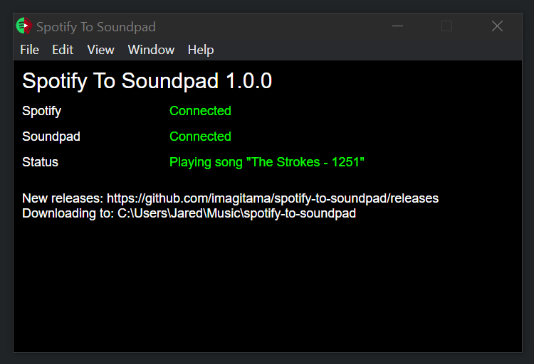

# Spotify to Soundpad

**You must have Soundpad and Spotify running BEFORE launching this software!**

A Windows app for synchronizing [Spotify](https://www.spotify.com/au/) with [Soundpad](https://leppsoft.com/soundpad/en/):

# How to use it

1. Download the latest `.exe` from the releases page
2. Open Spotify and play a song
3. Open Soundpad
4. Run the `.exe`

It periodically checks what is playing in Spotify and if it changes it will automatically pause Spotify, download an MP3 of the song from YouTube, add it to Soundpad and play it.

# Issues

## It takes forever to load / Windows Defender complains

Run it anyway and/or add it to Windows Defender exceptions.

## Spotify next track isnt played

In spotify go to settings and uncheck "Show desktop overlay when using media keys".

# Development

1. download `yt-dlp.exe` (v2022.05.18) and `ffmpeg.exe` (4.2.3) and place into `bin` directory in root
2. run `npm run build` to build every bit
3. run `npm run package` to package up as a single app for distribution (under `release` directory)

# Ideas

- pre-download songs such as in a playlist to avoid delay
- fade between songs
- normalise volume level (some youtube songs are super quiet)
